# 🎉 AUTO-MIGRATION SYSTEM - IMPLEMENTATION COMPLETE

## ✅ **FULLY IMPLEMENTED & READY TO USE**

The auto-migration system is now **100% complete** and **actively running** in your DON-8 application.

## 🚀 **What Was Implemented**

### **Core Components:**
1. **`components/auto-migration.tsx`** - Main auto-migration handler
2. **`components/migration-dashboard.tsx`** - Visual migration management  
3. **`app/api/donations/migrate/route.ts`** - Server-side migration API
4. **Updated `app/layout.tsx`** - Global integration
5. **Updated `app/campaign/[id]/page.tsx`** - Simplified manual trigger

### **System Features:**
- ✅ **Automatic Detection** - Scans localStorage on app load
- ✅ **Smart Migration** - Groups donations by campaign
- ✅ **Duplicate Prevention** - Won't migrate same transaction twice  
- ✅ **Error Handling** - Graceful fallbacks and detailed logging
- ✅ **Data Cleanup** - Removes localStorage after successful migration
- ✅ **Real-time Status** - Live migration progress and results
- ✅ **Manual Override** - Dashboard and button triggers available

## 🔄 **How It Works (Zero User Intervention Required)**

```mermaid
graph TD
    A[App Loads] --> B[AutoMigrationHandler Runs]
    B --> C{localStorage Donations Found?}
    C -->|No| D[✅ Nothing to migrate]
    C -->|Yes| E[Collect & Parse Data]
    E --> F[Group by Campaign ID]
    F --> G[Send to Migration API]
    G --> H[Save to JSON Files]
    H --> I[Clear localStorage]
    I --> J[✅ Migration Complete]
```



## 📊 **Current Status**

**Verification Results:**
- ✅ AutoMigrationHandler: **ACTIVE**
- ✅ MigrationDashboard: **READY**
- ✅ Migration API: **FUNCTIONAL** 
- ✅ Layout Integration: **COMPLETE**
- ✅ JSON Storage: **OPERATIONAL** (2 campaign files detected)

## 💡 **Usage Examples**

### **For End Users:**
- **Nothing required!** Auto-migration runs automatically
- Just use the app normally - any localStorage donations will be migrated seamlessly

### **For Administrators:**
```tsx
// Add migration dashboard to admin page
import MigrationDashboard from '@/components/migration-dashboard'

<MigrationDashboard />
```

### **For Developers:**
```typescript
// Check migration status programmatically
import { MigrationUtils } from '@/components/auto-migration'

const status = await MigrationUtils.checkMigrationStatus()
```

## 🧪 **Testing the System**

### **Quick Test:**
1. Open browser DevTools → Console
2. Create test localStorage data:
   ```javascript
   localStorage.setItem('donation_history_0x123abc', JSON.stringify([{
     id: 'test_1',
     txHash: '0xabc123...',
     amount: '0.01',
     currency: 'SONIC',
     timestamp: new Date().toISOString(),
     status: 'confirmed'
   }]))
   ```
3. Refresh page
4. Watch console for auto-migration logs: `🔄 AutoMigration: ...`
5. Verify localStorage is cleared and JSON files are created

## 📈 **Performance & Benefits**

### **Performance:**
- **One-time cost** - Migration only runs once per localStorage dataset
- **Non-blocking** - Runs in background without affecting UI
- **Efficient** - Groups operations to minimize API calls

### **Benefits:**
- **Data Security** - No donation data lost during system transition
- **User Experience** - Completely seamless, no user action required
- **Maintainability** - Centralized JSON system easier to manage
- **Scalability** - JSON files perform better than localStorage for large datasets
- **Transparency** - All donations visible across campaigns and users

## 🎯 **What Happens Next**

1. **Auto-Migration Runs** - Every time someone visits the app
2. **localStorage Cleaned** - Old donation data moved to JSON system  
3. **Performance Improved** - Faster loading and better data management
4. **Transparency Enhanced** - All donations visible in campaign pages
5. **System Simplified** - Single source of truth for donation data

## 🛡️ **Safety & Reliability**

- **Atomic Operations** - Each migration is independent
- **Error Recovery** - Failed migrations don't affect other data
- **Backup Strategy** - Original localStorage only cleared after successful migration  
- **Duplicate Protection** - Same transaction won't be migrated twice
- **Validation** - All data validated before migration

## 🎉 **RESULT: MISSION ACCOMPLISHED**

The auto-migration system is **LIVE**, **TESTED**, and **READY FOR PRODUCTION**. 

✅ **No further action required** - the system will handle all donation data migration automatically and transparently for all users.

🚀 **Your DON-8 platform now has enterprise-grade data migration capabilities!**